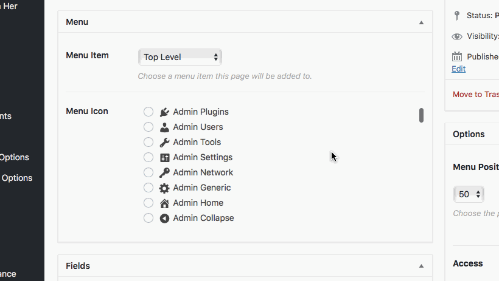

```

function cmb2_dashicon_radio_metabox() {

	$prefix = 'yourprefix_demo_';

	$cmb = new_cmb2_box( array(
		'id'            => $prefix . 'metabox',
		'title'         => __( 'Test Metabox', 'cmb2' ),
		'object_types'  => array( 'page', 'post' ), // Post type
		// 'show_on_cb' => 'yourprefix_show_if_front_page', // function should return a bool value
		// 'context'    => 'normal',
		// 'priority'   => 'high',
		// 'show_names' => true, // Show field names on the left
		// 'cmb_styles' => false, // false to disable the CMB stylesheet
		// 'closed'     => true, // true to keep the metabox closed by default
	) );

	$cmb->add_field( array(
		'name'             => __( 'Test Radio Image', 'cmb2' ),
		'desc'             => __( 'field description (optional)', 'cmb2' ),
		'id'               => $prefix . 'dashicon',
		'type'             => 'dashicon_radio',		
	) );

}
dd_action( 'cmb2_admin_init', 'cmb2_dashicon_radio_metabox' );
```


## Screenshots


